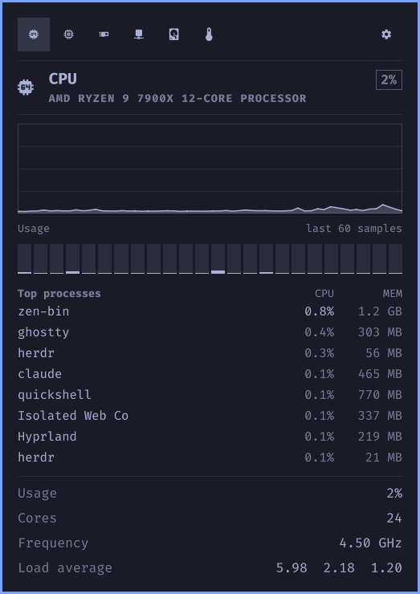
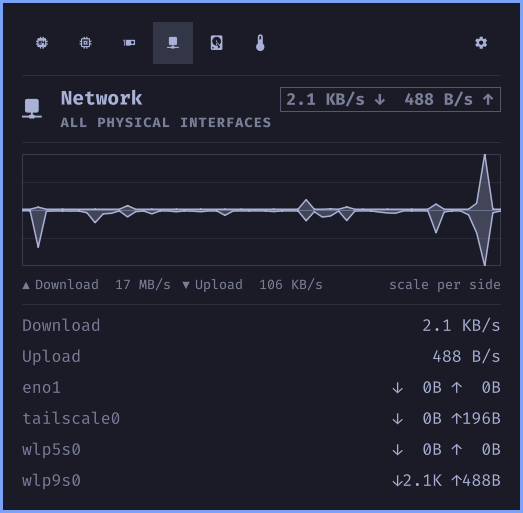
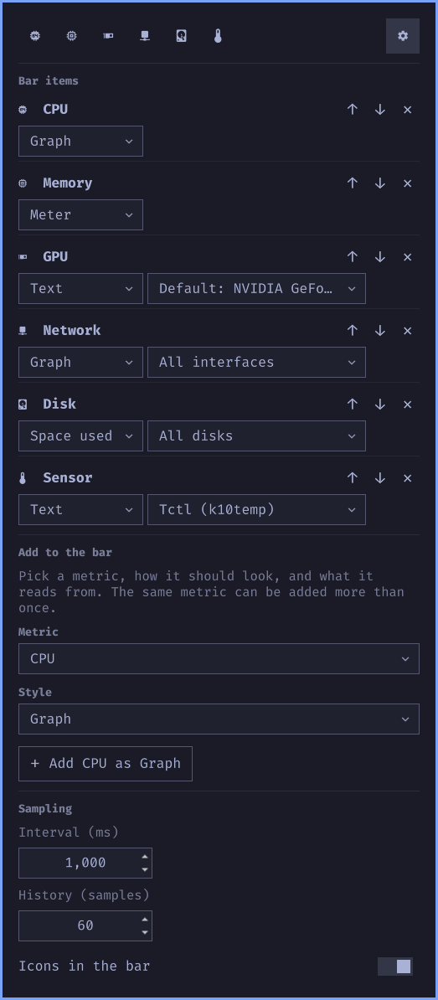

# menu-stats

iStat Menus, but for Omarchy.


A shell plugin that puts a strip of live system graphs in the Omarchy bar.
You choose what is in the strip: CPU, memory, GPU, network, disk, or any
temperature or fan, each as a sparkline, a meter, or text. Clicking an item
opens its detail page.

Everything is read from `/proc` and `/sys` inside the shell. There are no
daemons and no polling scripts. The only subprocesses are `nvidia-smi` for
NVIDIA utilisation, `df` for free space, and a read of `/proc/*/stat` for
the process table, and each runs only while something is showing it.

## Screenshots

| CPU page | Network page |
|---|---|
|  |  |



## Install

```
omarchy plugin add https://github.com/mikevalstar/menu-stats.git --enable
```

Or by hand: clone into `~/.config/omarchy/plugins/valstar.menu-stats`, run
`omarchy-shell shell rescanPlugins`, then
`omarchy plugin enable valstar.menu-stats --section center`.

The plugin runs entirely inside `omarchy-shell`. It needs no root, no
sudoers entry, no system service, and installs no packages.

## Remove

```
omarchy plugin remove valstar.menu-stats
```

This deletes the checkout under `~/.config/omarchy/plugins/` and drops the
widget's entry from `~/.config/omarchy/shell.json`. To keep the settings but
hide the widget, use `omarchy plugin disable valstar.menu-stats` instead.

## Dependencies

- Omarchy 4 with `omarchy-shell` (Quickshell 0.3). Nothing else is required.
- `nvidia-smi` on the path for NVIDIA utilisation, VRAM, and power. Without
  it the GPU item shows nothing for NVIDIA cards. AMD cards are read from
  sysfs. Intel shows frequency only.
- `df` from coreutils for disk space, present on every Omarchy install.

## Using it

- Left click an item for its page. Right click, or the gear, for settings.
- Left and Right step between pages, `,` opens settings, Escape goes back
  and then closes.
- Settings live inline on the widget's entry in `~/.config/omarchy/shell.json`,
  so they survive reinstalls and can be edited by hand. The plugin only
  writes that one entry, and only when you change something on its settings
  page. See [docs/settings.md](docs/settings.md).
- Hotkeys can drive it over IPC:
  `omarchy-shell valstar.menu-stats.nav showItem 0` or `showConfig`.

## Metrics

| Metric | Bar value | Page |
|---|---|---|
| CPU | busy fraction | history, per-core meters, top processes, frequency, load |
| Memory | used fraction | history, breakdown, swap, top processes by memory |
| GPU | busy percent | history, VRAM, temperature, power; one entry per card |
| Network | download and upload, mirrored | history, per-interface rates and totals |
| Disk | read and write, mirrored, or space used | history, filesystem usage, per-disk rates |
| Sensor | one temperature or fan | history, every sensor found, grouped |

## Docs

Intent and design for each part is in [docs/](docs/README.md). Start with
[docs/widget.md](docs/widget.md). Contributors and agents should read
[AGENTS.md](AGENTS.md) for the development loop, which has a few
non-obvious rules. Marketplace requirements are in
[docs/publishing.md](docs/publishing.md).

## Status

Working on Omarchy 4 with Quickshell 0.3. Not yet done: keyboard cursor in
the settings page, process actions, Intel GPU utilisation.

## License

[MIT](LICENSE).
